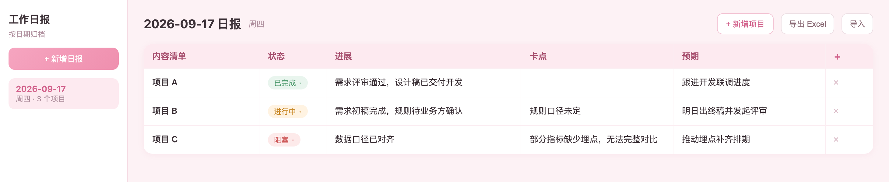

# 日报看板 · daily-report-board

实习生给 mentor 写日报的小工具。一个 HTML 文件,双击打开即用,无需安装、无需部署、无需账号。

[**▶ 在线体验**](https://judy-1003.github.io/daily-report-board/) · [下载单文件](https://raw.githubusercontent.com/Judy-1003/daily-report-board/main/index.html)

## 功能

- **日报按日期归档** — 左侧列表,点「+ 新增日报」开一天,可切换、删除
- **每个项目一行** — 默认五列:内容清单、状态、进展、卡点、预期
- **表头可自定义** — 表头点一下改列名;右上角「+」加列(可选普通文字列或状态胶囊列);列名旁「×」删列
- **状态彩色胶囊** — 点击弹下拉切换:未开始 / 进行中 / 已完成 / 阻塞
- **格子直接编辑** — 点进单元格就能改,输入即保存,无需保存按钮
- **列宽可拖拽** — 拖表头右边缘调整,宽度自动记住
- **导出 Excel** — 一键生成 `.xlsx`
- **导入 Excel / CSV** — 读入表格恢复数据,表头会同步成文件里的列

## 使用

1. 打开[在线版](https://judy-1003.github.io/daily-report-board/),或下载 `index.html` 双击
2. 点「+ 新增项目」填今天的事
3. 下班前点「导出 Excel」发给 mentor

## 说明

- 数据存在浏览器 localStorage,只在本机,清缓存会丢,重要日报记得导出备份
- 无后端、无账号、无埋点
- 导入表格需含表头,首列为 `日期`,其余列名与内容一一对应
- 全部代码在单个 `index.html` 里,配色和文案改开头 CSS 即可
